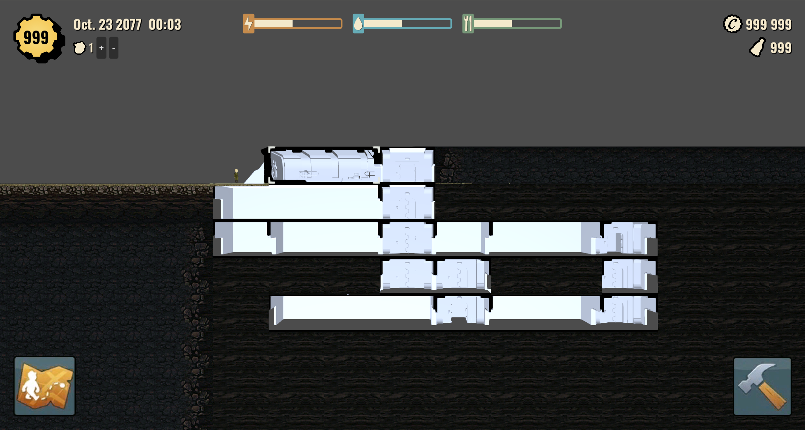

# Fallout Shelter: Project Safe House 🏚️

Fallout Shelter: Project Safe House is a Fallout fan game that aim to enhance the Fallout Shelter experience.
The idea is to completely remake the original game by improving, changing or adding features. (This game is not based on the code of Fallout Shelter)

## This Project Need Help!

I'm not a real developer and I'm doing this project with the little knowledge I have by trying to immitate the code of talented people but I know there are still a lot of problems in what I've written.

I also don't have a lot of time to continue this project on my own so if you have more time and knowledge than me in programming or in any other field that could be useful, don't hesitate to help me make this project cleaner and bring new features to it.

> Here's what the project looks like (perhaps not up to date)

## Star History

> Thank you for your support ❤️
